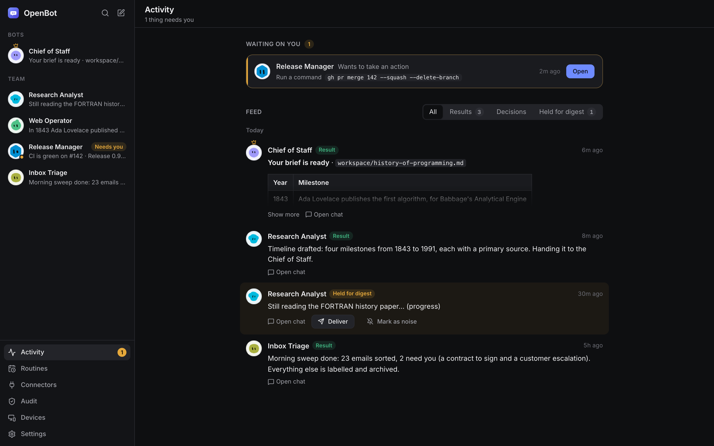

<p align="center">
  
</p>

<h1 align="center">OpenBot</h1>

<p align="center">
  Your AI team, in one local-first desktop workspace.
  <br />Bring your own accounts. Keep control of your data, tools, and computer.
</p>

<p align="center">
  <a href="https://github.com/sanlega/OpenBot/actions/workflows/ci.yml"></a>
  
  
</p>

<p align="center">
  
</p>

OpenBot is a desktop app for managing persistent AI Bots in a familiar team chat.
Choose Claude Code or Codex for each Bot, then let a selective **Chief of Staff**
coordinate work across your roster. **Jev** routes work and applies the safety gates.

Your keys and logins stay on your machine. OpenBot has no hosted backend and ships
no bundled credentials.

## What you can do

- **Build a small AI team.** Give each Bot its own role, model, permissions, and
  computer access.
- **Delegate through the Chief of Staff.** It can bring in a specialist when useful
  and keep you updated in the same conversation.
- **Review actions.** Bots request approval for gated actions; Activity collects
  results and messages waiting for you.
- **Use a virtual computer.** With Docker Desktop, Bots can use a shared Linux
  desktop with a live view and screen takeover. Bots share the workspace and
  computer, so they are not a security boundary.
- **Stay in control.** Configure permissions, routines, connected tools, and optional
  phone pairing from the app.

<p align="center">
  
</p>

## Get OpenBot

OpenBot is in active development. Download an installer from the
[latest GitHub Release](https://github.com/sanlega/OpenBot/releases/latest):
macOS DMGs are provided for Apple Silicon and Intel, Windows has an x64 installer,
and Linux has AppImage and `.deb` packages. Installers are unsigned, so your
operating system may show a security warning.

Or build from source. You need Node.js **22.12 or newer** and pnpm **10**:

```sh
corepack enable
pnpm install
pnpm build
pnpm --filter @openbot/desktop start
```

On first launch, follow the setup wizard. Add a TypeSafe (Jev) key and connect at
least one engine: Claude Code or Codex. Docker Desktop is optional and enables the
virtual computer. OpenBot stores credentials in the local system vault.

## Run the web UI

You can run the harness without the desktop shell and open its local UI in a browser:

```sh
pnpm --filter @openbot/server dev serve
```

Then visit [http://127.0.0.1:4577/app](http://127.0.0.1:4577/app).

## Develop and test

```sh
pnpm install
pnpm build
pnpm typecheck
pnpm test
pnpm lint
pnpm format:check
```

The monorepo uses TypeScript, Electron, React, Fastify, SQLite, and pnpm workspaces.
Unit and integration tests use fake engines and services by default, so routine
development does not require provider credentials. Playwright covers desktop and
cross-package flows.

For how it works inside (processes, a chat turn, safety gates, computer use,
storage, Client API), see [docs/architecture.md](docs/architecture.md).

See [CONTRIBUTING.md](CONTRIBUTING.md) for pull request guidance and the optional
AI-assisted workflow included with the repository.

## Project status

The core desktop, chat, team, approval, routine, and computer workflows are wired
and exercised in automated tests. OpenBot is still an early preview; real-provider
and remote-access combinations continue to receive manual testing. See the
[open issues](https://github.com/sanlega/OpenBot/issues) for current gaps.

## License

[MIT](LICENSE)
