# OpenBot architecture

How OpenBot is put together: processes, packages, a chat turn, the safety gates,
routines, computer use, remote access, storage, and the Client API. For how to install
and run it, see the [README](../README.md). Decisions behind this design are in
[`.ai/memory/DECISIONS.md`](../.ai/memory/DECISIONS.md).

## How it works

OpenBot is one local **harness** process that owns all state and talks to
everything else. The desktop app, the phone PWA, and any other client are thin views
over its Client API (HTTP + WebSocket).

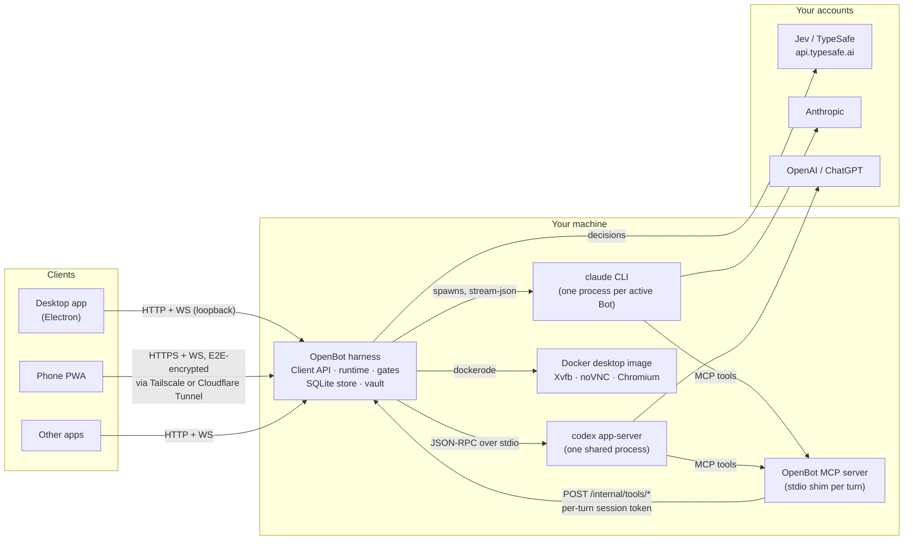

The key ideas:

- **Bots are conversations, engines are workers.** A Bot is a persistent identity
  with a DM thread, a permission preset, limits, and connectors. Each message starts
  an engine _turn_ on Claude Code or Codex, which Jev picks per turn unless the Bot
  is pinned.
- **Bots act through OpenBot tools.** Every turn gets an OpenBot MCP server
  (`message_user`, `send_message`, `create_bot`, `request_approval`,
  `computer_task`, `create_routine`, ...). Each call carries a session token bound to
  the Bot, turn, chain, and mode, and goes through the same gates as everything else.
- **Safety is enforced in code, not only in prompts.** A permission broker, Jev
  gates, loop guards, and hard caps (S1–S10) sit between Bots and anything with a
  side effect. A refusal is a structured result the Bot can act on, not an error.
- **Selectivity is the product.** The Chief of Staff is judged by how few Bots it
  creates and how rarely it interrupts you. Gates hold chatter for the daily digest.

## Architecture

### Packages

TypeScript monorepo (pnpm workspaces). Cross-package imports go only through
`@openbot/contracts` (zod schemas and types for every entity, event, and SPI) and the
`CoreContext` service registry.

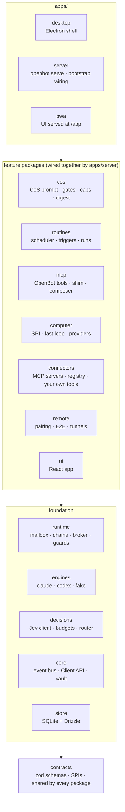

| Package               | Responsibility                                                                                                              |
| --------------------- | --------------------------------------------------------------------------------------------------------------------------- |
| `packages/contracts`  | Shared zod schemas and TS types: entities, events, `EngineDriver`, `DecisionService`, `Computer`, `ConnectorProvider` SPIs. |
| `packages/store`      | SQLite schema (Drizzle), numbered migrations, repositories.                                                                 |
| `packages/core`       | Config, durable event bus, Client API (HTTP + WS), setup validators, devices, vault.                                        |
| `packages/runtime`    | Mailbox (one active turn per Bot), chains and limits, permission broker, loop guards, delivery, spend caps.                 |
| `packages/engines`    | `ClaudeDriver`, `CodexDriver`, and a scriptable `FakeEngineDriver`.                                                         |
| `packages/decisions`  | `DecisionService`: Jev client, per-purpose rate budgets, conservative fallbacks, question builders, model router.           |
| `packages/cos`        | Chief of Staff prompt, spawn gate, notify gate, caps S1–S10, digest.                                                        |
| `packages/mcp`        | OpenBot MCP tools, their HTTP route, the stdio shim engines spawn, and the per-turn composer.                               |
| `packages/computer`   | `Computer` SPI, Docker and local providers, the Jev fast loop, takeover.                                                    |
| `packages/connectors` | MCP servers, the MCP Registry, and tools you or your Bots create.                                                           |
| `packages/remote`     | QR pairing, device keys, E2E framing, Tailscale and Cloudflare managers.                                                    |
| `packages/routines`   | Scheduler, trigger sources, run orchestration, dry runs.                                                                    |
| `packages/ui`         | The React app shared by the desktop and the phone PWA.                                                                      |
| `apps/server`         | `openbot serve/doctor/pair`, and `bootstrap.ts`, which wires every package together.                                        |
| `apps/desktop`        | Electron main/preload, harness in a `utilityProcess`, tray, packaging.                                                      |

### Processes

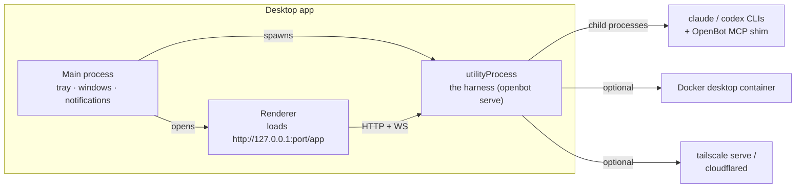

Headless, the same harness runs as `openbot serve`. It binds to `127.0.0.1` unless
you turn on **Allow phones on this Wi-Fi** (Devices), which binds `0.0.0.0` and
restarts the harness. The harness writes its log to `~/.openbot/logs/harness.log`.

## A chat turn, step by step

What happens between typing a message and seeing the reply:

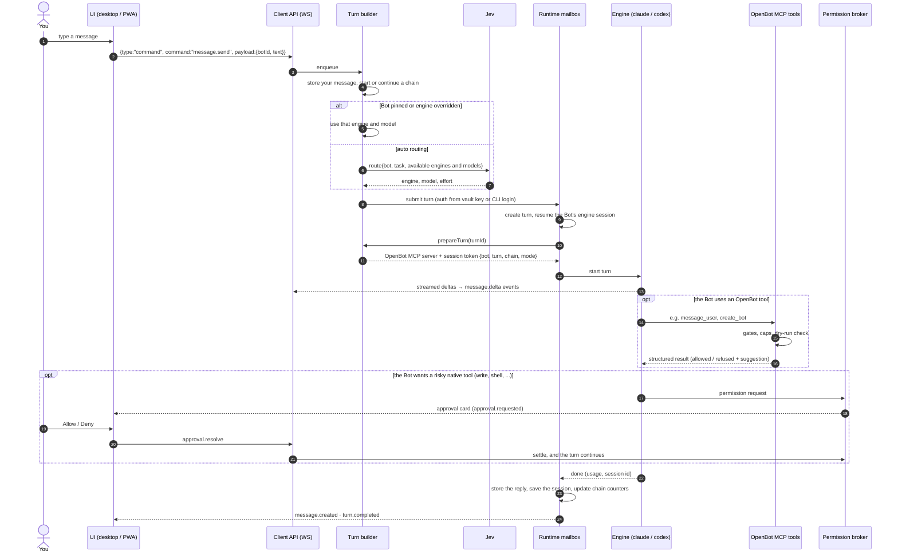

Every step above is also an event in the durable event log. The WebSocket replays
from any `since` cursor, so a client that reconnects misses nothing and sees nothing
twice.

## Safety: the permission broker

Every tool, computer, and connector action a Bot attempts goes through one broker.
The order is fixed, and a deny always wins:

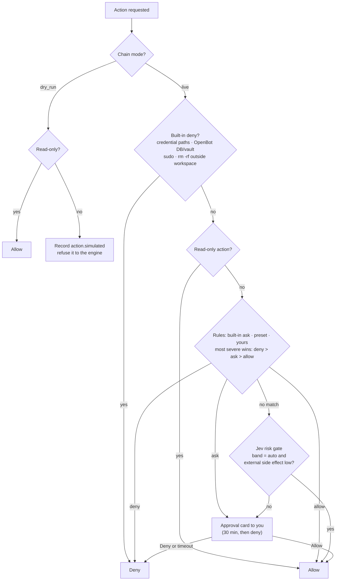

Around the broker, **chain limits** (hops, bot-to-bot messages, turns, computer
steps, wall time, routine depth) and **loop guards** pause a chain that runs away,
and **spend caps** stop turns at the per-Bot and global daily limits.

## The Chief of Staff: spawn and notify gates

The CoS may create Bots and message you on its own, but three layers stand in the
way: its prompt ("handle it yourself first"), Jev gates, and hard caps the Bots
never see. The same notify gate applies to every Bot's proactive message.

**Spawning a Bot** (`create_bot`, Chief of Staff only):

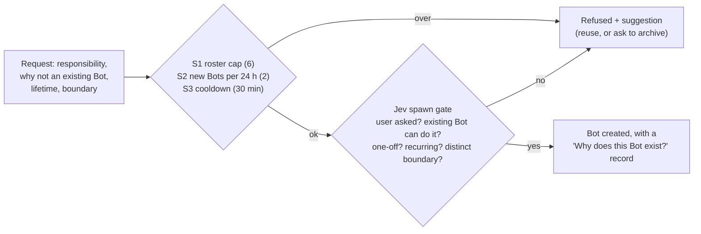

**Messaging you** (`message_user`, any Bot):

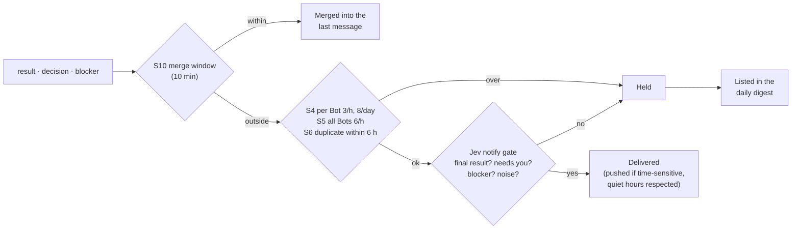

Caps live in **Settings** (S1–S10) and apply immediately. Spawn history and message
counts come from the store, so restarting the app does not reset them. If Jev is
unreachable or no TypeSafe key is set, decisions fall back to conservative defaults:
spawns are refused unless you asked, risk is never auto-allowed, triggers are
dropped.

## Routines

A routine is a prompt a Bot runs on a schedule or when an event arrives (a webhook, a file change, another OpenBot event). Every routine starts in
dry-run mode.

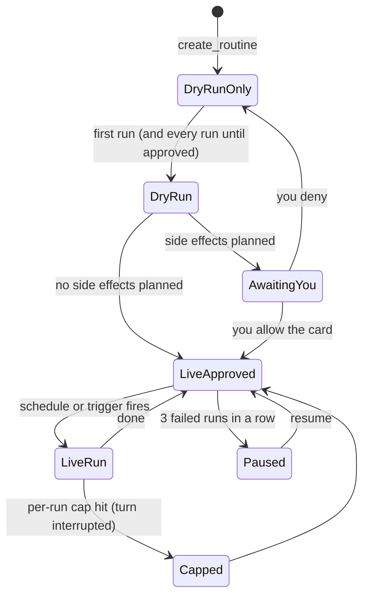

A **dry run** is the Bot's real turn in a `dry_run` chain. Anything with a side
effect is recorded and refused, never executed, and the recorded actions become the
run's plan:

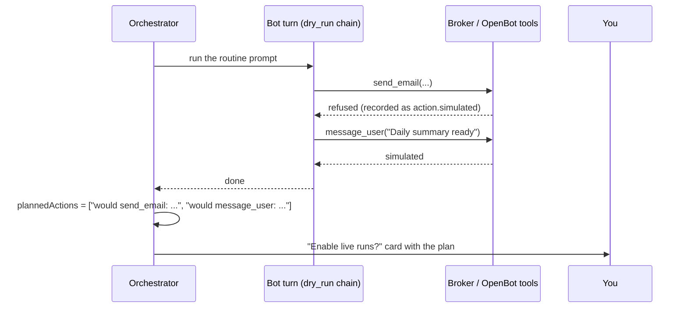

Guardrails (defaults): at most 10 routines per Bot and 30 in total; schedules no
more often than every 15 minutes; per run $0.50, 200K tokens, 10 turns, 50 computer
steps, 15 minutes; per routine $2 and 24 runs a day; bursts of events coalesce into
one run, and Jev drops events that don't match the routine.

## Computer use

Bots share one computer: by default a Docker desktop (Xvfb, noVNC live view,
Chromium) with one screen per Bot and the shared workspace mounted at `/workspace`.
Your own machine is opt-in and asks every time. Jev drives a fast, cheap control
loop and only escalates when it has to:

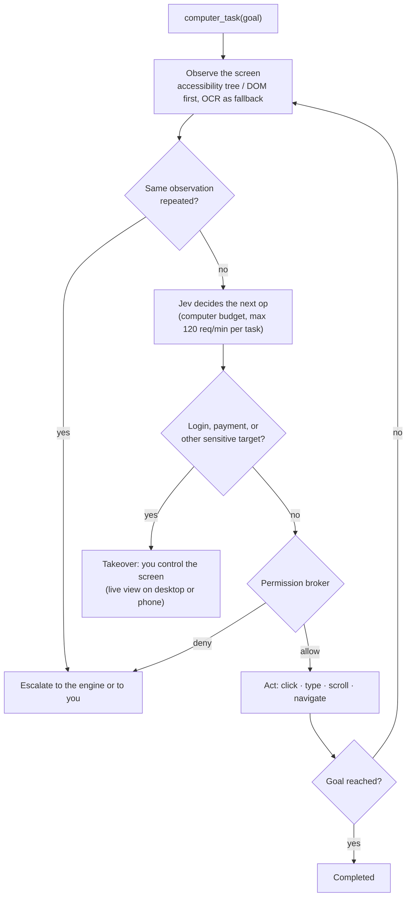

## Remote access and pairing

There is no OpenBot relay. The harness is reached through **your** Tailscale
(`tailscale serve`) or **your** Cloudflare Tunnel (`cloudflared`, outbound only, with
Cloudflare Access in front). On top of either, devices pair with a QR code and every
frame is end-to-end encrypted.

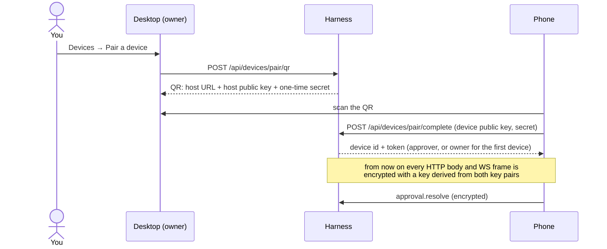

Roles: **approver** devices can read, send messages, resolve approvals, and run
routines. Only **owner** devices can change settings, caps, rules, devices, the
vault, or remote setup. Loopback requests from the desktop count as the local owner.

## Data and storage

Everything lives under `OPENBOT_HOME` (default `~/.openbot`):

```text
~/.openbot/
  openbot.db              SQLite: bots, threads, messages, chains, turns, approvals,
                          rules, routines, runs, devices, decisions, events, settings
  vault.bin, vault.key    AES-256-GCM secrets (API keys, device secret, MCP token secret)
  logs/threads/*.ndjson   append-only event log per thread
  workspace/              the shared workspace (/workspace in the Docker desktop)
  uploads/  trash/  screens/<botId>/  routines/<rtnId>/runs/  models.json
```

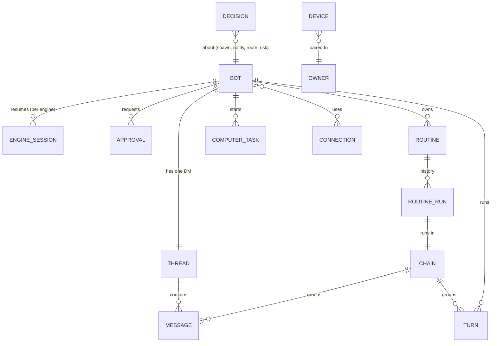

- A **chain** is the unit of loop protection: one user request, routine run, or bot
  hand-off, with counters for turns, hops, bot messages, spend, and computer steps.
- A **message** records how it was delivered: `delivered`, `held`, or `merged`.
  Held messages appear only under **Activity → Not delivered** and in the digest.
- Secrets never enter prompts, events, or logs. Engines get them only as environment
  variables, and connector tokens never reach model context.

## Client API

Served by the harness on `127.0.0.1:4577` (plan §4.7; routes in
`packages/core/src/http/routes/`).

| Area               | Endpoints                                                                                                                                                                                                            |
| ------------------ | -------------------------------------------------------------------------------------------------------------------------------------------------------------------------------------------------------------------- |
| Basics             | `GET /health`, `GET /api/engines`, `GET/PUT/PATCH /api/settings`, `GET /api/setup`, `POST /api/setup/validate`, `POST /api/setup/complete`                                                                           |
| Bots               | `GET/POST /api/bots`, `GET/PATCH/DELETE /api/bots/:id`, `POST /api/bots/:id/duplicate`, `GET/PUT /api/bots/:id/route`, `GET /api/bots/:id/why`                                                                       |
| Threads            | `GET /api/threads`, `GET /api/threads/:id/messages?delivery=`, `POST /api/threads/:id/stop`, `POST /api/messages/:id/promote\|mute`, `GET /api/activity`                                                             |
| Safety             | `GET /api/approvals`, `POST /api/approvals/:id/resolve`, `POST /api/chains/:id/resume\|stop`, `GET/POST/DELETE /api/rules`                                                                                           |
| Computer           | `GET /api/computer/status`, `POST /api/computer/start`, `GET /api/computer/screens/:botId/live`, `POST .../takeover`, `GET /api/computer/tasks`                                                                      |
| Routines           | `GET/POST /api/routines`, `GET/PATCH/DELETE /api/routines/:id`, `POST .../run\|pause\|resume\|enable-live`, `GET .../runs`, `GET /api/runs/:id`, `POST /hooks/:routineId`                                            |
| Devices and remote | `POST /api/devices/pair/qr`, `POST /api/devices/pair/complete`, `GET /api/devices`, `DELETE /api/devices/:id`, `GET /api/remote/status`, `POST /api/remote/tailscale/enable\|disable`, `POST /api/remote/cloudflare` |
| Audit              | `GET /api/usage`, `GET /api/audit`, `GET /api/decisions`                                                                                                                                                             |
| Internal           | `POST /internal/tools/:name` (OpenBot MCP tools; `X-OpenBot-Session` token)                                                                                                                                          |

WebSocket `/api/ws`:

```jsonc
// subscribe: replay every event after `since`, then stream live ones
{ "type": "subscribe", "since": 41 }
// commands: message.send, approval.resolve, turn.stop, routine.run
{ "type": "command", "command": "message.send", "payload": { "botId": "bot_…", "text": "hi" } }
// server → client
{ "type": "event", "event": { "seq": 42, "type": "message.created", "botId": "bot_…", "payload": { … } } }
{ "type": "command.result", "command": "message.send", "ok": true, "chainId": "chn_…", "engine": "claude" }
```

## Configuration

Most configuration happens in the setup wizard and **Settings**. Environment
variables, mainly for headless runs and tests:

| Variable                                                            | Default                   | Purpose                                                        |
| ------------------------------------------------------------------- | ------------------------- | -------------------------------------------------------------- |
| `OPENBOT_HOME`                                                      | `~/.openbot`              | Data directory.                                                |
| `PORT`                                                              | `4577`                    | Client API port.                                               |
| `JEV_API_KEY`                                                       | vault                     | TypeSafe key; overrides the one saved by the wizard.           |
| `JEV_BASE_URL`                                                      | `https://api.typesafe.ai` | Another Jev-compatible endpoint (a proxy, or a fake in tests). |
| `ANTHROPIC_API_KEY`, `OPENAI_API_KEY`                               | vault / CLI login         | Engine API keys; without them the CLIs use their own login.    |
| `OPENBOT_LOCAL_COMPUTER=1`                                          | off                       | Use your own machine as the computer (asks every time).        |
| `OPENBOT_FAKE_JEV`, `OPENBOT_FAKE_ENGINES`, `OPENBOT_FAKE_COMPUTER` | off                       | Fakes for tests and CI (`=1`).                                 |
| `OPENBOT_PWA_STATIC_ROOT`                                           | built PWA                 | Serve the UI from another directory.                           |

## Testing

Every package is tested against the WS0 fakes with zero credentials; real engines
and Jev are opt-in.

| Layer             | What runs                                                                                       | Command                                   |
| ----------------- | ----------------------------------------------------------------------------------------------- | ----------------------------------------- |
| Unit and contract | Vitest across packages (conformance suites for engines, computer, connectors)                   | `pnpm test`                               |
| Milestone E2E     | The real `openbot serve` with fake engines and computer; Jev in-process or a scripted HTTP fake | `pnpm --filter @openbot/e2e test:e2e`     |
| UI E2E            | The PWA at `/app` in Chromium against the real server                                           | included above                            |
| Desktop E2E       | Electron app via Playwright `_electron`                                                         | `pnpm --filter @openbot/desktop test:e2e` |

E2E scenarios play the engine's part the way a real one would. They call
`/internal/tools/*` with session tokens signed by the harness, and the fake engine
acts out tool use from the message text:

```text
@tool message_user {"kind":"result","body":"Daily summary ready"}   # OpenBot MCP call
@approve Bash {"command":"rm -rf build"}                             # native tool asking permission
```

Set `OPENBOT_E2E_CHROMIUM=/path/to/chromium` to run the UI scenarios with a
preinstalled browser.
